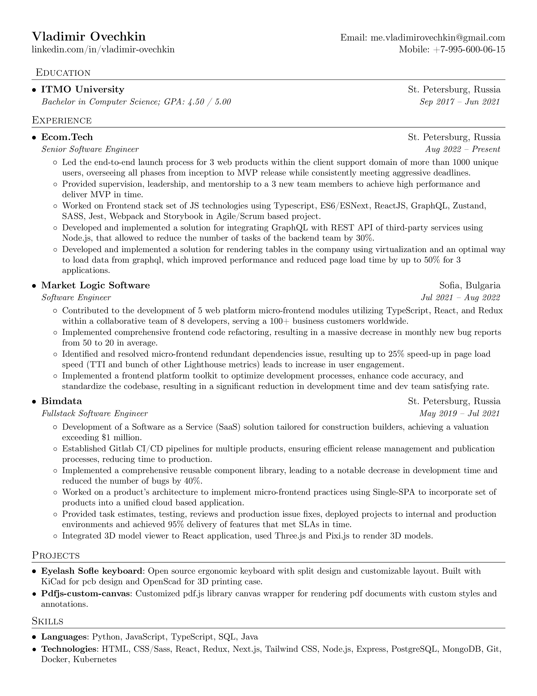

# Vladimir Ovechkin resume

PDF Resume builder written with LaTeX. PDF is generated using Docker container.

## How to update on change

To automatically rebuild the resume when changes are made, use Docker Compose:

```sh
docker-compose up 
```

## How to build

Generates 2 resume files:
- `vladimir_ovechkin_resume_en.pdf` - English version
- `vladimir_ovechkin_resume_ru.pdf` - Russian version

```sh
# Run once to allow execute for build script
chmod +x build.sh

# Run to build
./build.sh
```

## Example

Here is how the resume looks like:



## Credits

- [sb2nov](https://github.com/sb2nov) Thank you for the template!
